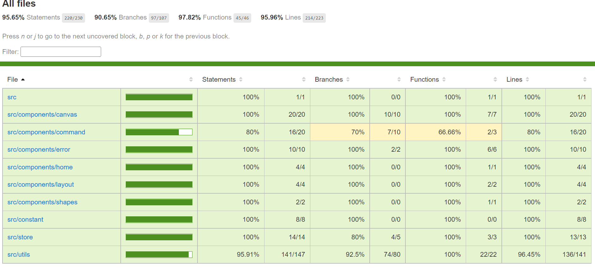
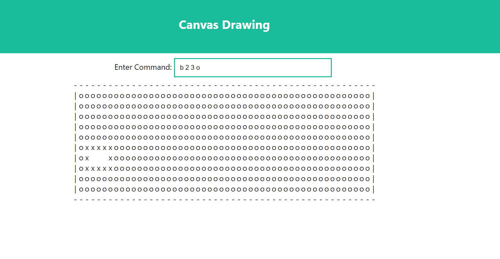

## Table of contents
* [General Info](#general-info)
* [Project Requirement](#project-requirement)
* [Project Start Command](#project-start-command)
* [Test Coverage Command](#test-coverage-command)
* [Project Page](#project-page)

*******************************************
## General Info

|Command 		|Description|
|---------------|-----------|
|C w h           |Should create a new canvas of width w and height h.|
|L x1 y1 x2 y2   |Should create a new line from (x1,y1) to (x2,y2)|
|R x1 y1 x2 y2   |Should create a new rectangle, whose upper left corner is (x1,y1) and lower right corner is(x2y2)|
|B x y c         |Should fill the entire area connected to (x,y) with "colour" c.
|Q               |Should quit the program.|

---------------------------------------------

## Project Requirement

* Node should be installed with version of atleast 10
* A package manager called npm which is already included in installation of Node

----------------------------------------------

## Project Start Command

* npm install
* npm start 

-----------------------------------------------

## Test Coverage Command

* npm run test-coverage

------------------------------------------------

## Project Page 

------------------------------------------------